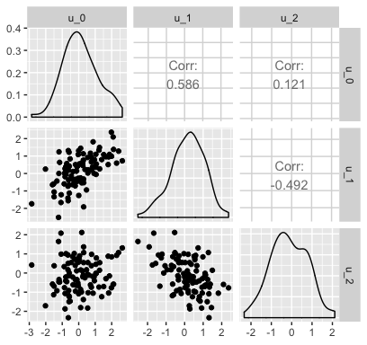
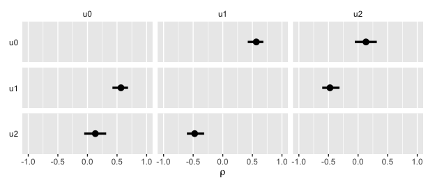

It's hard to plot Bayesian correlations
================
A Solomon Kurz
2019-05-31

Data
----

Simulate data for three variables with known correlations.

``` r
library(tidyverse)

m <- c(0, 0, 0)      # the means
s <- c(1, 1, 1)      # the sigmas
r <- c(.6, .1, -.5)  # the correlations

# here's the variance/covariance matrix
v <- 
  matrix(c((s[1] * s[1]),        (s[2] * s[1] * r[1]), (s[3] * s[1] * r[2]),
           (s[2] * s[1] * r[1]), (s[2] * s[2]),        (s[3] * s[2] * r[3]),
           (s[3] * s[1] * r[2]), (s[3] * s[2] * r[3]), (s[3] * s[3])),
         nrow = 3, ncol = 3)

# after setting our seed, we're ready to simulate with `mvtnorm::rmvnorm()`
set.seed(1)
d <- 
  mvtnorm::rmvnorm(n = 100, mean = m, sigma = v) %>% 
  data.frame() %>% 
  set_names(str_c("u_", 0:2))

head(d)
```

    ##          u_0        u_1        u_2
    ## 1 -0.6095441  0.1905395 -0.9147111
    ## 2  1.5135437  1.0849048 -0.7058298
    ## 3  0.7712262  0.6593263  0.3841974
    ## 4  0.2799714  1.1290014 -0.1025137
    ## 5 -1.2253672 -2.5179057  1.6485081
    ## 6  0.0531848 -0.3050232  0.8971690

They look like this.

``` r
d %>% 
  GGally::ggpairs()
```



Model
-----

Load brms and tidybayes.

``` r
library(brms)
library(tidybayes)
```

To get the correlation estimates, fit an intercepts-only multivariate model.

``` r
fit <- 
  brm(data = d, 
      family = gaussian,
      mvbind(u_0, u_1, u_2) ~ 1,
      prior = c(prior(normal(0, 1), class = Intercept),
                prior(normal(1, 1), class = sigma, resp = u0),
                prior(normal(1, 1), class = sigma, resp = u1),
                prior(normal(1, 1), class = sigma, resp = u2),
                prior(lkj(4), class = rescor)),
      chains = 4, cores = 4, 
      seed = 1,
      file = "fit")
```

Here are the model results.

``` r
print(fit)
```

    ##  Family: MV(gaussian, gaussian, gaussian) 
    ##   Links: mu = identity; sigma = identity
    ##          mu = identity; sigma = identity
    ##          mu = identity; sigma = identity 
    ## Formula: u_0 ~ 1 
    ##          u_1 ~ 1 
    ##          u_2 ~ 1 
    ##    Data: d (Number of observations: 100) 
    ## Samples: 4 chains, each with iter = 2000; warmup = 1000; thin = 1;
    ##          total post-warmup samples = 4000
    ## 
    ## Population-Level Effects: 
    ##              Estimate Est.Error l-95% CI u-95% CI Eff.Sample Rhat
    ## u0_Intercept     0.11      0.10    -0.09     0.32       3376 1.00
    ## u1_Intercept     0.16      0.09    -0.02     0.34       3377 1.00
    ## u2_Intercept    -0.12      0.09    -0.30     0.05       3807 1.00
    ## 
    ## Family Specific Parameters: 
    ##          Estimate Est.Error l-95% CI u-95% CI Eff.Sample Rhat
    ## sigma_u0     1.06      0.08     0.92     1.22       3512 1.00
    ## sigma_u1     0.90      0.06     0.79     1.03       2827 1.00
    ## sigma_u2     0.90      0.07     0.79     1.05       3333 1.00
    ## 
    ## Residual Correlations: 
    ##               Estimate Est.Error l-95% CI u-95% CI Eff.Sample Rhat
    ## rescor(u0,u1)     0.56      0.07     0.42     0.69       3041 1.00
    ## rescor(u0,u2)     0.13      0.09    -0.05     0.32       3318 1.00
    ## rescor(u1,u2)    -0.47      0.07    -0.61    -0.31       3834 1.00
    ## 
    ## Samples were drawn using sampling(NUTS). For each parameter, Eff.Sample 
    ## is a crude measure of effective sample size, and Rhat is the potential 
    ## scale reduction factor on split chains (at convergence, Rhat = 1).

Here's a more focused look at the correlations.

``` r
VarCorr(fit)$residual__$cor
```

    ## , , u0
    ## 
    ##     Estimate  Est.Error        Q2.5     Q97.5
    ## u0 1.0000000 0.00000000  1.00000000 1.0000000
    ## u1 0.5629406 0.06676036  0.42211749 0.6856051
    ## u2 0.1331299 0.09409785 -0.05458429 0.3164433
    ## 
    ## , , u1
    ## 
    ##      Estimate  Est.Error       Q2.5      Q97.5
    ## u0  0.5629406 0.06676036  0.4221175  0.6856051
    ## u1  1.0000000 0.00000000  1.0000000  1.0000000
    ## u2 -0.4707783 0.07421831 -0.6053786 -0.3139582
    ## 
    ## , , u2
    ## 
    ##      Estimate  Est.Error        Q2.5      Q97.5
    ## u0  0.1331299 0.09409785 -0.05458429  0.3164433
    ## u1 -0.4707783 0.07421831 -0.60537862 -0.3139582
    ## u2  1.0000000 0.00000000  1.00000000  1.0000000

Get ready to plot
-----------------

Here we'll extract the posterior samples for the correlations and summarize them with `tidybayes::median_qi()`.

``` r
c <- 
  posterior_samples(fit) %>% 
  select(starts_with("rescor")) %>% 
  gather() %>% 
  group_by(key) %>% 
  median_qi(value)
  
print(c)
```

    ## # A tibble: 3 x 7
    ##   key             value  .lower .upper .width .point .interval
    ##   <chr>           <dbl>   <dbl>  <dbl>  <dbl> <chr>  <chr>    
    ## 1 rescor__u0__u1  0.566  0.422   0.686   0.95 median qi       
    ## 2 rescor__u0__u2  0.133 -0.0546  0.316   0.95 median qi       
    ## 3 rescor__u1__u2 -0.475 -0.605  -0.314   0.95 median qi

The names in `key` are a mess. Let's rearrange a bit.

``` r
c <-
  c %>% 
  mutate(key = str_remove(key, "rescor__")) %>% 
  separate(key, into = c("l", "r"))

c
```

    ## # A tibble: 3 x 8
    ##   l     r      value  .lower .upper .width .point .interval
    ##   <chr> <chr>  <dbl>   <dbl>  <dbl>  <dbl> <chr>  <chr>    
    ## 1 u0    u1     0.566  0.422   0.686   0.95 median qi       
    ## 2 u0    u2     0.133 -0.0546  0.316   0.95 median qi       
    ## 3 u1    u2    -0.475 -0.605  -0.314   0.95 median qi

Now we'll repeat the estimates for the opposite sides of the diagonal.

``` r
c <-
  c %>% 
  rename(l = r, 
         r = l) %>% 
  bind_rows(c)

c
```

    ## # A tibble: 6 x 8
    ##   r     l      value  .lower .upper .width .point .interval
    ##   <chr> <chr>  <dbl>   <dbl>  <dbl>  <dbl> <chr>  <chr>    
    ## 1 u0    u1     0.566  0.422   0.686   0.95 median qi       
    ## 2 u0    u2     0.133 -0.0546  0.316   0.95 median qi       
    ## 3 u1    u2    -0.475 -0.605  -0.314   0.95 median qi       
    ## 4 u1    u0     0.566  0.422   0.686   0.95 median qi       
    ## 5 u2    u0     0.133 -0.0546  0.316   0.95 median qi       
    ## 6 u2    u1    -0.475 -0.605  -0.314   0.95 median qi

Here's a way to plot the coefficients in a correlation-matrix-like presentation.

``` r
c %>% 

  ggplot(aes(x = value, y = 0)) +
  geom_pointintervalh() +
  scale_y_discrete(NULL, position = "right") +
  xlab(expression(rho)) +
  coord_cartesian(xlim = -1:1) +
  theme(strip.background = element_blank(),
        strip.text.y     = element_text(angle = 180, hjust = 0),
        axis.text.y      = element_text(hjust = 0)) +
  facet_grid(l~r, switch = "y")
```



Session info
------------

``` r
sessionInfo()
```

    ## R version 3.5.1 (2018-07-02)
    ## Platform: x86_64-apple-darwin15.6.0 (64-bit)
    ## Running under: macOS High Sierra 10.13.6
    ## 
    ## Matrix products: default
    ## BLAS: /Library/Frameworks/R.framework/Versions/3.5/Resources/lib/libRblas.0.dylib
    ## LAPACK: /Library/Frameworks/R.framework/Versions/3.5/Resources/lib/libRlapack.dylib
    ## 
    ## locale:
    ## [1] en_US.UTF-8/en_US.UTF-8/en_US.UTF-8/C/en_US.UTF-8/en_US.UTF-8
    ## 
    ## attached base packages:
    ## [1] stats     graphics  grDevices utils     datasets  methods   base     
    ## 
    ## other attached packages:
    ##  [1] tidybayes_1.0.4 brms_2.8.8      Rcpp_1.0.1      forcats_0.3.0  
    ##  [5] stringr_1.4.0   dplyr_0.8.0.1   purrr_0.2.5     readr_1.1.1    
    ##  [9] tidyr_0.8.1     tibble_2.1.1    ggplot2_3.1.1   tidyverse_1.2.1
    ## 
    ## loaded via a namespace (and not attached):
    ##  [1] nlme_3.1-137              matrixStats_0.54.0       
    ##  [3] xts_0.10-2                lubridate_1.7.4          
    ##  [5] RColorBrewer_1.1-2        threejs_0.3.1            
    ##  [7] httr_1.3.1                rprojroot_1.3-2          
    ##  [9] rstan_2.18.2              tools_3.5.1              
    ## [11] backports_1.1.4           utf8_1.1.4               
    ## [13] R6_2.3.0                  DT_0.4                   
    ## [15] lazyeval_0.2.2            colorspace_1.3-2         
    ## [17] withr_2.1.2               prettyunits_1.0.2        
    ## [19] processx_3.2.1            tidyselect_0.2.5         
    ## [21] gridExtra_2.3             GGally_1.4.0             
    ## [23] Brobdingnag_1.2-6         compiler_3.5.1           
    ## [25] cli_1.0.1                 rvest_0.3.2              
    ## [27] arrayhelpers_1.0-20160527 xml2_1.2.0               
    ## [29] shinyjs_1.0               labeling_0.3             
    ## [31] colourpicker_1.0          scales_1.0.0             
    ## [33] dygraphs_1.1.1.5          mvtnorm_1.0-10           
    ## [35] callr_3.1.0               ggridges_0.5.0           
    ## [37] StanHeaders_2.18.0-1      digest_0.6.18            
    ## [39] rmarkdown_1.10            base64enc_0.1-3          
    ## [41] pkgconfig_2.0.2           htmltools_0.3.6          
    ## [43] htmlwidgets_1.2           rlang_0.3.4              
    ## [45] readxl_1.1.0              rstudioapi_0.7           
    ## [47] shiny_1.1.0               svUnit_0.7-12            
    ## [49] generics_0.0.2            zoo_1.8-2                
    ## [51] jsonlite_1.5              crosstalk_1.0.0          
    ## [53] gtools_3.8.1              inline_0.3.15            
    ## [55] magrittr_1.5              loo_2.1.0                
    ## [57] bayesplot_1.6.0           Matrix_1.2-14            
    ## [59] fansi_0.4.0               munsell_0.5.0            
    ## [61] abind_1.4-5               stringi_1.4.3            
    ## [63] yaml_2.1.19               ggstance_0.3             
    ## [65] pkgbuild_1.0.2            plyr_1.8.4               
    ## [67] grid_3.5.1                parallel_3.5.1           
    ## [69] promises_1.0.1            crayon_1.3.4             
    ## [71] miniUI_0.1.1.1            lattice_0.20-35          
    ## [73] haven_1.1.2               hms_0.4.2                
    ## [75] ps_1.2.1                  knitr_1.20               
    ## [77] pillar_1.3.1              igraph_1.2.1             
    ## [79] markdown_0.8              shinystan_2.5.0          
    ## [81] stats4_3.5.1              reshape2_1.4.3           
    ## [83] rstantools_1.5.1          glue_1.3.1.9000          
    ## [85] evaluate_0.10.1           modelr_0.1.2             
    ## [87] httpuv_1.4.4.2            cellranger_1.1.0         
    ## [89] gtable_0.3.0              reshape_0.8.7            
    ## [91] assertthat_0.2.0          mime_0.5                 
    ## [93] xtable_1.8-2              broom_0.5.1              
    ## [95] coda_0.19-2               later_0.7.3              
    ## [97] rsconnect_0.8.8           shinythemes_1.1.1        
    ## [99] bridgesampling_0.6-0
