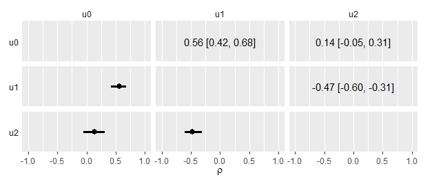

Adding upper triangle strings
================
Jeffrey M Girard
2019-06-01

``` r
library(mvtnorm)
library(brms)
library(tidybayes)
library(tidyverse)
```

## Data

``` r
# Recreate data
m <- c(0.0, 0.0, 0.0)
s <- c(1.0, 1.0, 1.0)
r <- c(0.6, 0.1, -0.5)
v <- matrix(
  c(
    (s[1] * s[1]), 
    (s[2] * s[1] * r[1]), 
    (s[3] * s[1] * r[2]),
    (s[2] * s[1] * r[1]), 
    (s[2] * s[2]), 
    (s[3] * s[2] * r[3]),
    (s[3] * s[1] * r[2]), 
    (s[3] * s[2] * r[3]), 
    (s[3] * s[3])
  ),
  nrow = 3, 
  ncol = 3
)
RNGversion("3.5.1")
set.seed(1)
d <-
  mvtnorm::rmvnorm(n = 100, mean = m, sigma = v) %>%
  data.frame() %>%
  set_names(str_c("u_", 0:2))
```

## Model

``` r
# Recreate model
fit <-
  brm(
    data = d,
    family = gaussian,
    formula = mvbind(u_0, u_1, u_2) ~ 1,
    prior = c(
      prior(normal(0, 1), class = Intercept),
      prior(normal(1, 1), class = sigma, resp = u0),
      prior(normal(1, 1), class = sigma, resp = u1),
      prior(normal(1, 1), class = sigma, resp = u2),
      prior(lkj(4), class = rescor)
    ),
    chains = 4, 
    cores = 4,
    seed = 1,
    file = "fit"
  )
```

## Tidy

``` r
# Create data for upper triangle
upper <- 
  posterior_samples(fit) %>% 
  select(starts_with("rescor")) %>% 
  gather() %>% 
  group_by(key) %>% 
  median_qi(value) %>% 
  mutate(key = str_remove(key, "rescor__")) %>% 
  separate(key, into = c("row", "col"))
# Create data for lower triangle
lower <- 
  upper %>% 
  rename(row = col, col = row)
# Combine the data for the two triangles
cmat <- 
  bind_rows("lower" = lower, "upper" = upper, .id = "triangle") %>% 
  # Add the estimate string and drop the non-plotted data
  mutate(
    .string = sprintf("%.2f [%.2f, %.2f]", value, .lower, .upper),
    value = if_else(triangle == "lower", value, NA_real_),
    .string = if_else(triangle == "upper", .string, NA_character_)
  ) %>% 
  select(triangle:.upper, .string, .width) %>% 
  print()
```

    ## # A tibble: 6 x 8
    ##   triangle col   row    value  .lower .upper .string              .width
    ##   <chr>    <chr> <chr>  <dbl>   <dbl>  <dbl> <chr>                 <dbl>
    ## 1 lower    u0    u1     0.564  0.418   0.678 <NA>                   0.95
    ## 2 lower    u0    u2     0.138 -0.0508  0.312 <NA>                   0.95
    ## 3 lower    u1    u2    -0.473 -0.604  -0.313 <NA>                   0.95
    ## 4 upper    u1    u0    NA      0.418   0.678 0.56 [0.42, 0.68]      0.95
    ## 5 upper    u2    u0    NA     -0.0508  0.312 0.14 [-0.05, 0.31]     0.95
    ## 6 upper    u2    u1    NA     -0.604  -0.313 -0.47 [-0.60, -0.31]   0.95

## Plot

``` r
# Recreate the plot adding geom_text() for the upper triangle
cmat %>% 
  ggplot(aes(x = value, y = 0)) +
  geom_pointintervalh(na.rm = TRUE) +
  geom_text(aes(label = .string), x = 0, na.rm = TRUE) +
  scale_y_discrete(NULL, position = "right") +
  xlab(expression(rho)) +
  coord_cartesian(xlim = -1:1) +
  theme(strip.background = element_blank(),
        strip.text.y     = element_text(angle = 180, hjust = 0),
        axis.text.y      = element_text(hjust = 0)) +
  facet_grid(row ~ col, switch = "y")
```

<!-- -->

## Session

``` r
sessionInfo()
```

    ## R version 3.6.0 (2019-04-26)
    ## Platform: x86_64-w64-mingw32/x64 (64-bit)
    ## Running under: Windows 10 x64 (build 17763)
    ## 
    ## Matrix products: default
    ## 
    ## Random number generation:
    ##  RNG:     Mersenne-Twister 
    ##  Normal:  Inversion 
    ##  Sample:  Rounding 
    ##  
    ## locale:
    ## [1] LC_COLLATE=English_United States.1252 
    ## [2] LC_CTYPE=English_United States.1252   
    ## [3] LC_MONETARY=English_United States.1252
    ## [4] LC_NUMERIC=C                          
    ## [5] LC_TIME=English_United States.1252    
    ## 
    ## attached base packages:
    ## [1] stats     graphics  grDevices utils     datasets  methods   base     
    ## 
    ## other attached packages:
    ##  [1] forcats_0.4.0      stringr_1.4.0      dplyr_0.8.1       
    ##  [4] purrr_0.3.2        readr_1.3.1        tidyr_0.8.3       
    ##  [7] tibble_2.1.1       ggplot2_3.1.1.9000 tidyverse_1.2.1   
    ## [10] tidybayes_1.0.4    brms_2.9.0         Rcpp_1.0.1        
    ## [13] mvtnorm_1.0-10    
    ## 
    ## loaded via a namespace (and not attached):
    ##  [1] nlme_3.1-140              matrixStats_0.54.0       
    ##  [3] xts_0.11-2                lubridate_1.7.4          
    ##  [5] threejs_0.3.1             httr_1.4.0               
    ##  [7] rstan_2.18.2              tools_3.6.0              
    ##  [9] backports_1.1.4           utf8_1.1.4               
    ## [11] R6_2.4.0                  DT_0.6                   
    ## [13] lazyeval_0.2.2            colorspace_1.4-1         
    ## [15] withr_2.1.2               tidyselect_0.2.5         
    ## [17] gridExtra_2.3             processx_3.3.1           
    ## [19] Brobdingnag_1.2-6         compiler_3.6.0           
    ## [21] cli_1.1.0                 rvest_0.3.4              
    ## [23] arrayhelpers_1.0-20160527 xml2_1.2.0               
    ## [25] shinyjs_1.0               labeling_0.3             
    ## [27] colourpicker_1.0          scales_1.0.0             
    ## [29] dygraphs_1.1.1.6          ggridges_0.5.1           
    ## [31] callr_3.2.0               digest_0.6.19            
    ## [33] StanHeaders_2.18.1        rmarkdown_1.13           
    ## [35] base64enc_0.1-3           pkgconfig_2.0.2          
    ## [37] htmltools_0.3.6           readxl_1.3.1             
    ## [39] htmlwidgets_1.3           rlang_0.3.4              
    ## [41] rstudioapi_0.10           shiny_1.3.2              
    ## [43] generics_0.0.2            svUnit_0.7-12            
    ## [45] zoo_1.8-6                 jsonlite_1.6             
    ## [47] crosstalk_1.0.0           gtools_3.8.1             
    ## [49] inline_0.3.15             magrittr_1.5             
    ## [51] loo_2.1.0                 bayesplot_1.7.0          
    ## [53] Matrix_1.2-17             fansi_0.4.0              
    ## [55] munsell_0.5.0             abind_1.4-5              
    ## [57] stringi_1.4.3             yaml_2.2.0               
    ## [59] pkgbuild_1.0.0.9000       plyr_1.8.4               
    ## [61] ggstance_0.3.1            grid_3.6.0               
    ## [63] parallel_3.6.0            promises_1.0.1           
    ## [65] crayon_1.3.4              miniUI_0.1.1.1           
    ## [67] lattice_0.20-38           haven_2.1.0              
    ## [69] hms_0.4.2                 zeallot_0.1.0            
    ## [71] knitr_1.23                ps_1.3.0                 
    ## [73] pillar_1.4.1              igraph_1.2.4.1           
    ## [75] markdown_0.9              shinystan_2.5.0          
    ## [77] reshape2_1.4.3            stats4_3.6.0             
    ## [79] rstantools_1.5.1          glue_1.3.1               
    ## [81] evaluate_0.14             modelr_0.1.4             
    ## [83] vctrs_0.1.0               httpuv_1.5.1             
    ## [85] cellranger_1.1.0          gtable_0.3.0             
    ## [87] assertthat_0.2.1          xfun_0.7                 
    ## [89] mime_0.6                  xtable_1.8-4             
    ## [91] broom_0.5.2               coda_0.19-2              
    ## [93] later_0.8.0               rsconnect_0.8.13         
    ## [95] shinythemes_1.1.2         bridgesampling_0.6-0
